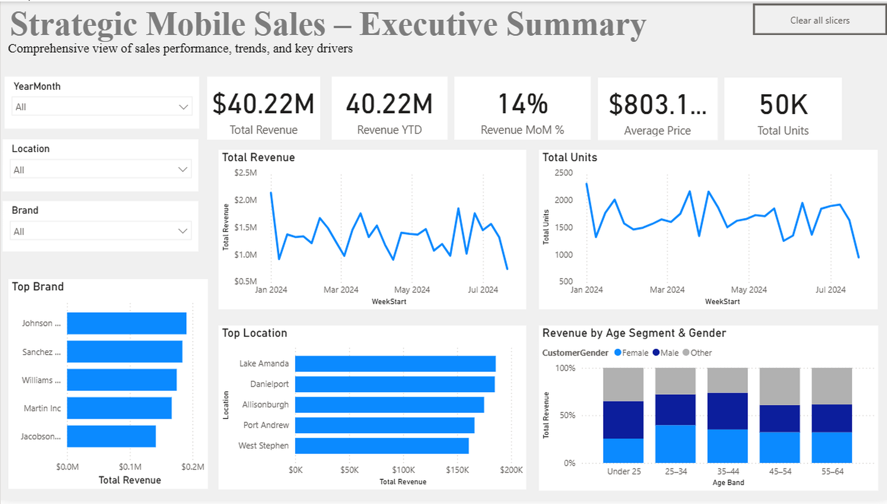
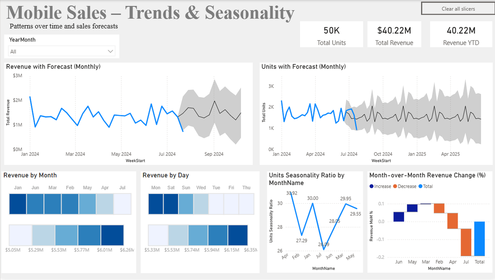
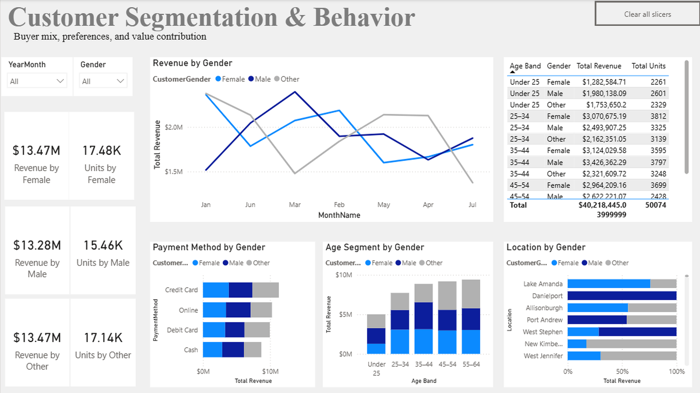
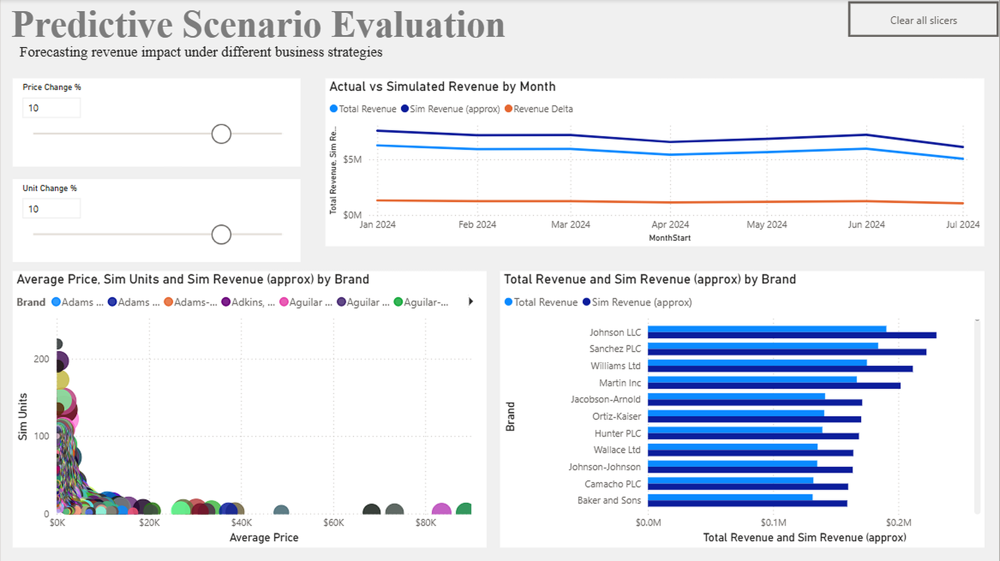

# 📱 Strategic Mobile Sales Analytics & Forecasting

An interactive **Power BI sales analytics solution** designed to analyze revenue performance, customer behavior, product and brand performance, seasonality, and potential business scenarios.

The project combines **data modeling, DAX, forecasting, customer segmentation, dynamic ranking, and What-If analysis** to transform transactional mobile sales data into actionable business insights.

---

## 🔗 Project Files

- [📊 View / Download Power BI Dashboard](PowerBI_Sales_Forecasting.pbix)
- [📄 View Project Report](PowerBI_Sales_Forecasting_Report.pdf)

---

## 📊 Executive Summary

The Executive Summary provides a high-level view of overall sales performance and key business drivers.

### Key Metrics
- **Total Revenue:** $40.22M
- **Total Units Sold:** 50K+
- **Average Selling Price:** ~$803
- **Revenue YTD:** $40.22M
- **Month-over-Month Revenue Change:** 14% for the current reporting context

Interactive slicers allow users to analyze performance by **month, location, and brand**.

---

## 📈 Sales Trends & Seasonality

This page explores sales patterns over time and provides forecasting views for both revenue and units.

### Analysis Includes
- Monthly revenue forecasting
- Unit sales forecasting
- Revenue patterns by month and day
- Seasonality analysis
- Month-over-month revenue change

The forecasting views provide an indication of expected future sales patterns based on historical behavior.

---

## 👥 Customer Segmentation & Behavior

Customer analysis evaluates how different demographic groups contribute to revenue and sales volume.

The dashboard explores:

- Revenue and units by gender
- Revenue contribution across age segments
- Payment preferences by gender
- Geographic differences across customer groups
- Detailed segment-level revenue and unit performance

This analysis helps identify customer groups that contribute strongly to overall business performance.

---

## 🔮 Predictive Scenario Evaluation

The What-If simulation enables users to evaluate how changes in **price and unit volume** could affect expected revenue.

Users can adjust:

- **Price Change %**
- **Unit Change %**

The dashboard then compares **actual revenue with simulated revenue** across time and brands, allowing alternative business scenarios to be evaluated interactively.

---

## 🧠 Analytical Techniques

The project demonstrates:

- Data cleaning and preparation
- Star-schema dimensional modeling
- DAX measures and calculated metrics
- Time-intelligence analysis
- Month-over-month analysis
- Dynamic Top-N ranking
- Customer segmentation
- Product and brand analysis
- Revenue and unit forecasting
- Seasonality analysis
- What-If parameter simulation
- Interactive dashboard design

---

## 🗂️ Data Model

The Power BI model follows a **star-schema structure** with a central sales fact table connected to supporting dimensions.

Key model components include:

- `FactSales`
- `Date`
- `DimProduct`
- `DimLocation`
- `DimPayment`

A dedicated Measures structure organizes calculations for core KPIs, ranking, segmentation, simulation, and time intelligence.

---

## 💡 Key Business Insights

The analysis identified several useful patterns:

- Overall sales generated approximately **$40.22M in revenue** from more than **50K units**.
- Sales performance varies across customer age segments, locations, brands, and payment methods.
- Customer segmentation highlights differences in revenue contribution and purchasing behavior across demographic groups.
- Product and brand analysis reveals differences between high-revenue and high-volume performers.
- Forecasting provides a forward-looking view of revenue and unit-sales patterns.
- What-If simulation allows potential pricing and volume strategies to be evaluated before implementation.

---

## 🛠️ Tools & Technologies

- **Power BI Desktop**
- **DAX**
- **Power Query**
- **Data Modeling**
- **Time-Series Forecasting**
- **Interactive Data Visualization**

---

## 📁 Repository Contents

- **Power BI (.pbix)** — complete interactive dashboard and data model
- **Project Report (.pdf)** — methodology, analysis, findings, and discussion
- **Dashboard Screenshots (.png)** — selected portfolio views

---

## 🎯 Project Purpose

This project demonstrates the development of an end-to-end business intelligence solution that moves beyond descriptive reporting to include **forecasting, segmentation, and interactive scenario analysis**.

The dashboard was developed as part of graduate-level Data Analytics coursework and has been refined for portfolio presentation.
